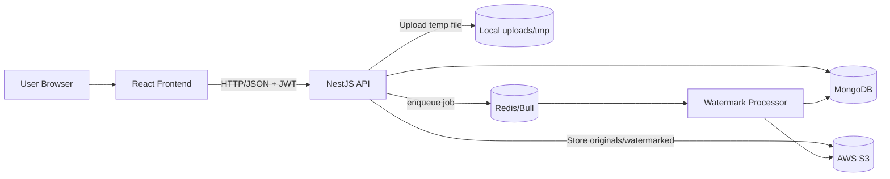

# Architecture Overview

## صورة عامة للمشروع

`alrhomi-catalog` هو نظام كتالوج منتجات مكوّن من:
- واجهة مستخدم React (الموقع العام + صفحة تسجيل الدخول + لوحة التحكم `/admin`)
- Backend API مبني بـ NestJS
- MongoDB لتخزين البيانات الأساسية
- Redis لطابور المعالجة غير المتزامنة
- AWS S3 لتخزين الصور

الهدف: إدارة المنتجات والفئات والصور من لوحة تحكم داخلية، مع عرض الكتالوج بشكل سريع وواضح للعملاء.

## نمط المعمارية

المشروع يتبع نمط **Modular Monolith**:
- Backend عبارة عن تطبيق NestJS واحد (Monolith على مستوى النشر)
- داخله موديولات واضحة ومفصولة منطقيا (Modular على مستوى الكود)
- Frontend تطبيق React منفصل يتواصل مع API عبر HTTP

ليس Microservices حاليا، لأن خدمات الدومين ليست منشورة كخدمات مستقلة متعددة.

## الموديولات الرئيسية في NestJS

من `backend/src/app.module.ts`:
- `AuthModule`: تسجيل الدخول والتحقق بالـ JWT
- `CategoriesModule`: إدارة الفئات/الفئات الفرعية
- `ProductsModule`: إدارة المنتجات
- `ImagesModule`: رفع الصور وربطها بالمنتجات
- `AdminModule`: وظائف الإدارة (Users/Images/Stats)
- `FoldersModule`: تنظيم الصور بالمجلدات
- `JobStatusModule`: تتبع حالة المهام الخلفية
- `QueueModule`: ربط Bull مع Redis (queue: `image-processing`)
- `StorageModule`: تكامل التخزين مع AWS S3
- `DatabaseModule`: اتصال MongoDB وتسجيل الـ schemas
- `HealthModule`: فحوصات الصحة (`/health/live`)
- `ConfigModule`: تحميل وإدارة متغيرات البيئة

## كيف يتواصل React مع API

- React يستخدم `axios` عبر `frontend/src/api/client.ts`
- عنوان الـ API يأتي من `REACT_APP_API_BASE_URL` (أو `http://localhost:5000` محليا)
- التوكن `accessToken` يُرسل تلقائيا في `Authorization: Bearer ...`
- عند `401/403` يتم مسح بيانات الجلسة وإرجاع المستخدم للصفحة الرئيسية

## الخدمات الخارجية المرتبطة

- **MongoDB**: قاعدة البيانات الأساسية (غالبا Atlas في الإنتاج)
- **Redis**: broker/queue backend لطوابير Bull
- **AWS S3**: تخزين الصور الأصلية والمائية
- **Nginx + Docker Compose**: تقديم الواجهة وتشغيل الخدمات
- **Traefik/Platform Network** (حسب بيئة النشر): routing على الدومينات

## أين الملفات المرفوعة؟

سير الرفع كالتالي:
1. الملف يصل إلى API ويخزن مؤقتا في `backend/uploads/` (Multer destination: `uploads/`)
2. الخدمة ترفعه إلى S3 داخل مسار مثل `originals/...`
3. تتم إزالة النسخة المحلية المؤقتة بعد الرفع
4. المعالجة الخلفية تنزل الملف إلى `backend/tmp/` لمعالجة العلامة المائية
5. النسخة المائية ترفع إلى S3 داخل `watermarked/...`
6. قاعدة البيانات تحتفظ بالروابط (`originalUrl`, `watermarkedUrl`)

في Docker production توجد volumes لهذه المسارات:
- `/app/uploads`
- `/app/tmp`

## أين الكاش؟

لا يوجد Cache Layer عام واضح حاليا للـ API responses.

الموجود فعليا:
- **Redis** يستخدم أساسا كـ backend لطوابير Bull (queue state, jobs, progress)

## مسار الطلب من الواجهة حتى قاعدة البيانات

مختصر التدفق:
- المستخدم ينفذ إجراء من React (عرض/بحث/إضافة/تعديل)
- React يرسل الطلب إلى NestJS API
- Guards + DTO Validation + Service Logic تُطبق داخل Nest
- البيانات تُقرأ/تُكتب في MongoDB
- في حالة الصور: يتم استخدام S3 + Queue (Redis/Bull) للمعالجة غير المتزامنة

## ملاحظات تشغيل سريعة

- Local Frontend: `http://localhost:3000`
- Local API: `http://localhost:5000`
- Swagger: `http://localhost:5000/api-docs`
